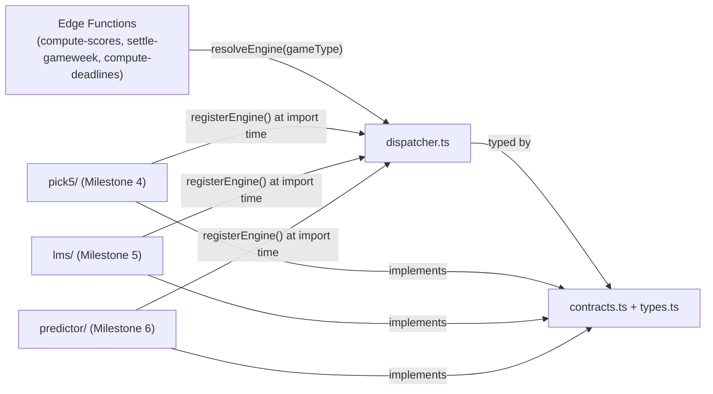
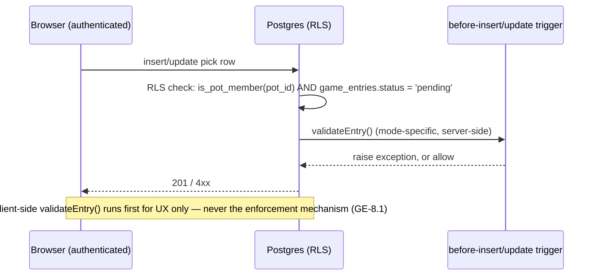
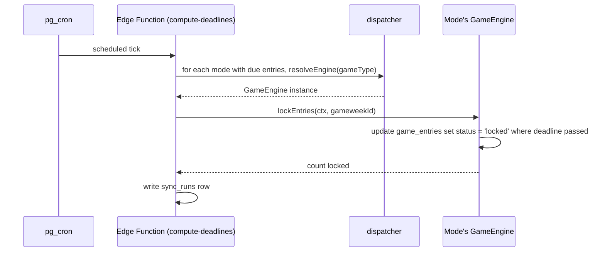
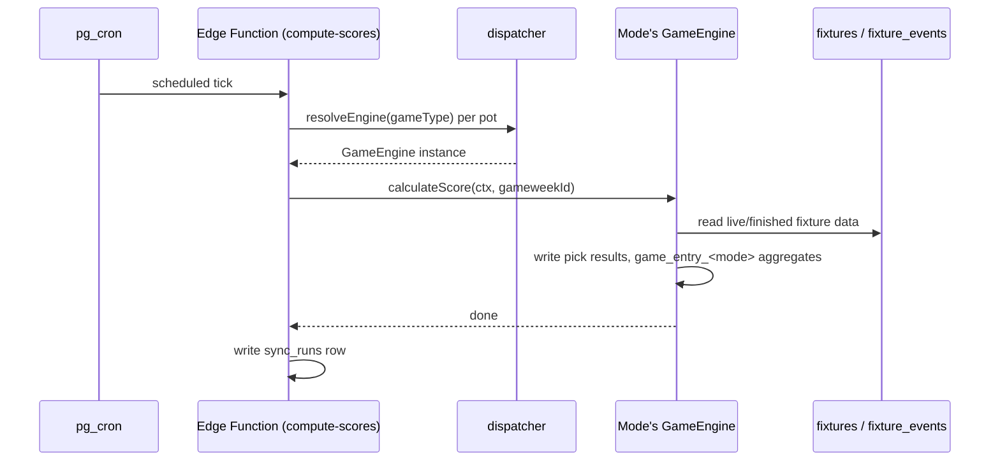
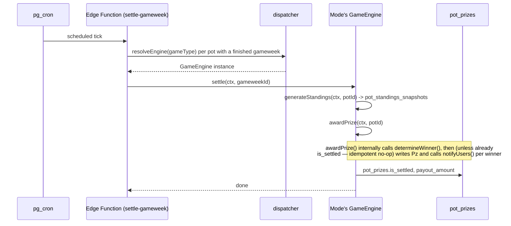
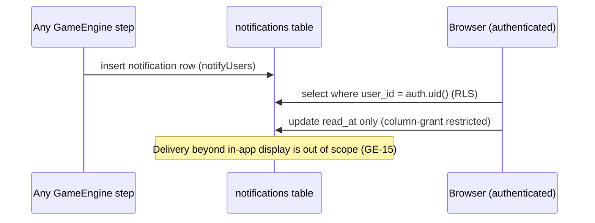

# Game Engine — Architectural Specification

Last reviewed: 2026-08-05. Status: **authoritative.** This document is now the blueprint
every migration, Edge Function, frontend page, RLS policy, and test is measured against.
Milestone 1 (this specification) and Milestone 2 (shared schema) are complete and have
passed a full architectural review — see [schema-review.md](./schema-review.md) for the
review itself and `session-log.md` for what was applied versus deliberately deferred.
Milestone 3 (the Game Engine framework — folder structure, interfaces, dispatcher, shared
types, dependency injection) is complete. Milestone 4 (Pick 5) is in progress: Slice 1
(entry creation), Slice 2 (pick submission), Slice 3 (locking, wired into
`compute-deadlines`), Slice 4 (scoring, wired into `compute-scores`), Slice 5
(settlement — including the payment-verification-void rule, wired into
`settle-gameweek`), Slice 6 (standings, resolving `ISSUE-15`/`ISSUE-17`, called
internally from `settle()` per GE-8.4), Slice 7 (`determineWinner()`, implemented
standalone), Slice 8 (`awardPrize()`, gross/net prize pool deductions, wired into
`settle()` alongside `determineWinner()` — see GE-9), and Slice 9 (`notifyUsers()`,
domain-event notifications, wired into `awardPrize()`) are done — all eight
`GameEngine` contract methods are now implemented for Pick 5. See
[GE-12](#ge-12-milestone-plan) for exact status per milestone.

It supersedes the undocumented, `supabase_admin`-owned LMS/Predictor prototype objects
described in [current-state.md](./current-state.md) — those objects communicated *business
intent*, which this document captures and formalizes; their *implementation* was not carried
forward (see [GE-15](#ge-15-explicitly-deferred--not-carried-forward)).

**Every `GE-N`-cited anchor is a stable, permanent reference** — never renumbered, never
reused, same rule as `ISSUE-N` in `current-state.md`. Cite it in commit messages, migration
headers, Edge Function doc-comments, and test descriptions. See
[GE-14](#ge-14-traceability-convention).

See also: [architecture.md](./architecture.md) (the current, live system this extends),
[database.md](./database.md) (schema reference — pending an update to describe the Game
Engine tables directly, tracked for Milestone 4), [schema-review.md](./schema-review.md)
(the Milestone 2 review and its outcomes, cited throughout this revision),
[business-rules.md](./business-rules.md), [decisions.md](./decisions.md).

---

## GE-0. Purpose and status

A specification, not a status report. What's "confirmed working" lives in
[current-state.md](./current-state.md); what's *intended* lives here. Drift between this
document and reality is tracked the normal way: `/drift` before every release, `ISSUE-N`
entries for anything that ships differently than specified, and an update to this document
itself if the specification was simply wrong.

## GE-1. Product vision

Three game modes launch together, all production-quality, none an "extra":

| Mode | One-line rule |
|---|---|
| **Pick 5** | Pick 5 players before the gameweek deadline; a pick wins if the player's goals meet the pick's threshold. |
| **Last Man Standing** | Pick one team to win each gameweek; a loss or draw eliminates you; team reuse restricted per cycle; last survivor(s) split the pot. |
| **Score Predictor** | Predict one fixture per gameweek — exact score, winner, goalscorer; cumulative points across the season; top scorer(s) split the pot at season end. |

## GE-2. Pot model

- Every pot has exactly one `game_type` (`pick5` | `last_man_standing` | `score_predictor`),
  set at creation and immutable thereafter — enforced by `trg_pots_contract_immutable`
  (`004_game_engine_shared_platform.sql`), not just convention.
- No hybrid pots, ever — structurally impossible, not merely disallowed by policy: every
  `game_entries` row belongs to exactly one `pot_id`, and a pot has exactly one `game_type`.
- **As of the Milestone 2 review, immutability extends beyond `game_type` alone.**
  `entry_fee`, `end_gameweek_id`, `predictor_cycle_mode`, and `predictor_scorer_scope` are
  also locked — but only once the pot has at least one `game_entries` row, so a genuine
  pre-launch admin correction is still possible. See
  [schema-review.md #4](./schema-review.md#pots-extended) for the reasoning: these are all
  terms of the competition's "contract," and changing any of them after money/picks are
  committed is a fairness problem, not just a `game_type`-specific one.

## GE-3. Platform vs. game-mode boundary

| Shared (one implementation, every mode) | Mode-specific (one implementation per mode) |
|---|---|
| Auth, users, profiles | Pick selection UI and validation rules |
| Pots, pot members, invitations | Scoring calculation |
| Payment Verification | Elimination/points/standing computation |
| Fixtures, teams, players, live data sync | Win-condition and payout-split logic |
| Notifications | — |
| Admin tooling | — |
| Leaderboard/standings infrastructure | — |
| Cron scheduling, Edge Function framework | — |
| RLS helper functions and pattern | — |

If a change to LMS ever requires touching `pots`, `pot_members`, `entry_payments`, or the
auth/RLS helpers, that's a signal this boundary has been violated, not a normal occurrence.

## GE-4. Shared entities

Reflects the schema as it exists after the Milestone 2 architectural review — see
[schema-review.md](./schema-review.md) for the full before/after reasoning on every point
below marked "post-review."

### GE-4.1 `pots` (extended)

`game_type`, `entry_fee` (`check >= 0`), `end_gameweek_id`, `predictor_cycle_mode`,
`predictor_scorer_scope` — all `not null`. Protected by `trg_pots_contract_immutable`
(broadened post-review from a `game_type`-only trigger — see [GE-2](#ge-2-pot-model)).

**Decided 2026-08-05, applied** (`010_prize_pool_deductions.sql`, applied ahead of
Milestone 4 Slice 8) — two independent, optional prize-pool deductions:
`admin_fee_type`/`admin_fee_amount`/`admin_fee_percentage` and
`charity_fee_type`/`charity_fee_amount`/`charity_fee_percentage` (shared `fee_type`
enum: `none`/`fixed`/`percentage`, never both an amount and a percentage at once —
enforced by CHECK, not convention). Configuration only, shared across every mode per
GE-3 — the calculated per-instance outcome lives on `pot_prizes` (GE-4.4). Joins
`entry_fee` in `trg_pots_contract_immutable`'s guarded set once the pot has entries.
Full reasoning: [decisions.md § Prize pool deductions](./decisions.md#prize-pool-deductions-admin-fee-and-charity-fee).

### GE-4.2 `pot_members`

Unchanged — fully mode-agnostic.

### GE-4.3 `entry_payments` (generalized) — Payment Verification, not payment processing

**Canonical design, decided 2026-08-05** — see
[decisions.md § Payment Verification, not payment processing](./decisions.md#payment-verification-not-payment-processing).
This table (and every mode's settlement logic that reads it) records **whether an
admin has verified an entry as paid**, off-platform — never a payment the application
collected. No mode's `settle()` may ever depend on a payment gateway, Stripe/PayPal/
Revolut API, or any external payment status; `entry_payments.is_paid` is the only
signal, and the application controls it entirely (manual single-entry admin action,
or bulk CSV import — see
[business-rules.md § Payment verification rules](./business-rules.md#payment-verification-rules)
for the CSV format and requirements; not yet implemented, tracked as `ISSUE-6`).

`gameweek_id` nullable, paired **(post-review)** with an explicit `scope pot_scope not
null` column and a check constraint tying the two together, rather than relying on
nullability alone to signal which payment-verification shape a row represents.
Non-null `gameweek_id` + `scope = 'gameweek'` keeps today's Pick 5 behavior exactly
as-is; `gameweek_id null` + `scope = 'season'` is a single whole-pot verification for
LMS/Predictor.

### GE-4.4 `pot_prizes`

Replaces the retired prototype's `gameweek_pots` (which turned out to be Pick 5's own
unbuilt weekly-jackpot feature, not an LMS/Predictor concern). `scope pot_scope`
discriminates a per-gameweek jackpot (Pick 5) from a season-long pot (LMS, Predictor).
**Post-review:** both FKs (`pot_id`, `gameweek_id`) are `on delete restrict`, not `cascade`
— a row holding real money must never be silently deletable as a side effect of deleting
something else. Has `updated_at`/trigger, matching every other mutable table in the schema
(a gap in the original draft).

**Row lifecycle, decided 2026-08-05** (design investigation ahead of Milestone 4
Slice 8) — see
[decisions.md § pot_prizes row creation is lazy, inside awardPrize()](./decisions.md#pot_prizes-row-creation-is-lazy-inside-awardprize--never-pre-created)
for the full comparison of alternatives considered. A row is created **lazily,
inside `awardPrize()`**, at the moment a mode's engine decides a specific
competition instance (a gameweek, for Pick 5) has concluded — never pre-created at
pot creation, gameweek open, first entry, or first payment verification, since
`gross_amount` can only be authoritative once verification and settlement have
finished for that instance. No schema/RLS change needed for this — `awardPrize()`
writes via the service-role client like every other Game Engine method, matching
the existing zero-client-write-policy pattern on this table. Confirmed live: no
migration was required *for the lifecycle itself*.

**Gross/net prize pool, decided 2026-08-05, applied** (`010_prize_pool_deductions.sql`)
— see
[decisions.md § Prize pool deductions](./decisions.md#prize-pool-deductions-admin-fee-and-charity-fee).
`total_amount` renamed to **`gross_amount`** (zero live rows existed, confirmed
before drafting the rename). Two new columns, `admin_fee_amount`/`charity_fee_amount`,
record the *calculated* euro amount actually deducted for this instance — never the
pot's configuration (GE-4.1), which can in principle differ across instances. A
generated `net_amount` column (`gross_amount − admin_fee_amount − charity_fee_amount`,
`check >= 0`) is the only amount the Game Engine ever distributes — `awardPrize()`
must never split `gross_amount`. `Pick5Engine.awardPrize()` implements this as of
Slice 8.

### GE-4.5 `game_entries` — the shared parent

`id`, `pot_id`, `user_id`, `gameweek_id` (nullable), `entry_scope pot_scope not null`
**(post-review — same reasoning as GE-4.3: an explicit column, not an inference from
nullability)**, `status` (`entry_status`, the single source of truth for administrative
lifecycle including settlement), `payout_amount` (`check >= 0`), `settled_at`,
`created_at`, `updated_at`.

**Post-review:** the original draft also had a separate `settled boolean` column — removed.
It duplicated `status = 'settled'` with no independent meaning, and two independently
writable columns for one fact is a drift risk once real settlement code writes to them
(Milestones 4–6). `status` + `settled_at` is sufficient: `status` for "is this resolved,"
`settled_at` for "when."

**Post-review:** `pot_id`/`user_id`/`gameweek_id` FKs are `on delete restrict`, not
`cascade` — this table carries `payout_amount`.

Three thin extension tables, 1:1 via `game_entry_id`:

```
game_entries
  ├── game_entry_pick5      (game_entry_id, picks_won, picks_total)
  ├── game_entry_lms        (game_entry_id, competitive_status, eliminated_gameweek_id, current_cycle)
  └── game_entry_predictor  (game_entry_id, total_points, exact_score_count, correct_scorer_count)
```

**Milestone 4, Slice 2** added `pick5_picks` (`007_pick5_picks.sql`): one row per
`(game_entry_id, pick_position)`, `player_id`, `goal_threshold`/`goals_scored`/`result`
— mirrors the retired prototype's `user_entry_picks` shape exactly (that part of the
prototype was correct; see [GE-15](#ge-15-explicitly-deferred--not-carried-forward)).
Unlike `game_entries` (which has client-reachable `insert`/`update` policies, even if
the current Edge Function doesn't use them), `pick5_picks` has **no client-insert
policy at all**, same as `game_entry_pick5` — every write goes through
`submit-pick5-picks`, which calls `Pick5Engine.validateEntry()` first. See
[GE-8.1](#ge-81-submission-flow)'s revised text for why.

Each carries a `check` constraint guarding against a provably-invalid state discovered
during the review (`picks_won <= picks_total`; `current_cycle >= 1`; `competitive_status =
'eliminated'` iff `eliminated_gameweek_id is not null`; every count `>= 0`).

### GE-4.6 `pot_standings_snapshots`

Replaces the Pick-5-only `leaderboard_snapshots`, resolving `ISSUE-15` (an overall
leaderboard was never populated) as a side effect. `meta jsonb` is deliberately restricted
to display-only metadata, never queried or joined on — see
[GE-20](#ge-20-architectural-invariants) for the platform-wide JSON policy this is the one
sanctioned instance of.

**Milestone 4 Slice 6**: `Pick5Engine.generateStandings()` is the first real writer of
this table, resolving `ISSUE-15` in practice (not just structurally) — it writes both a
per-gameweek row and a `gameweek_id: null` overall row per user, upserted (idempotent) on
every `settle()` call. Ranking uses standard competition ranking with ties sharing a rank
and no further tiebreak, resolving `ISSUE-17` — confirmed with the repo owner rather than
inferred, since real money is involved. **Implementation note**: this table's two unique
indexes are both partial (`WHERE gameweek_id IS NOT NULL` / `WHERE gameweek_id IS NULL`),
which PostgREST's `upsert(onConflict: ...)` cannot target directly — confirmed live
("no unique or exclusion constraint matching the ON CONFLICT specification"). Worked
around in `Pick5Engine` by looking up existing rows by their natural key first, then
upserting only by `id` (the real, non-partial primary key). Any future mode writing to
this table needs the same pattern, not a direct `upsert(onConflict: 'pot_id,gameweek_id,user_id')`.

### GE-4.7 Invitations

`pots.invite_code` (existing) + `redeem_invite(invite_code)`, a `security definer` RPC that
creates the `pot_members` row. Deliberately **does not yet** enforce `pots.max_members` or
`pots.status` — a real gap identified in the review, deferred on purpose to Milestone 7
(when this function gets an actual UI caller) rather than fixed blind now. See
[GE-15](#ge-15-explicitly-deferred--not-carried-forward).

### GE-4.8 Notifications

`notifications` table (`user_id`, `pot_id` nullable, `type`, `payload` jsonb — display
metadata only, `read_at`, `created_at`), written to by every Game Engine implementation's
`notifyUsers()`. Delivery beyond in-app (email/push) is out of scope for this specification.
**`Pick5Engine.notifyUsers()` implemented as of Milestone 4 Slice 9** — see
[decisions.md § Notifications: domain events, not delivery](./decisions.md#notifications-domain-events-not-delivery)
for the full design (why it's a pure event emitter, why a notification failure never
affects settlement, why delivery is deliberately deferred). One event type exists today:
`pick5.prize_awarded`, fired from within `awardPrize()`.

### GE-4.9 RLS helper functions

Unchanged: `is_pot_member(pot_id)`, `is_pot_admin(pot_id)`, `is_app_admin()`. Every table
above reuses these — no new authorization primitive anywhere in this design.

## GE-5. Game-mode-specific entities

### GE-5.1 Pick 5

Rules unchanged (canonical in `business-rules.md`). Re-platforms onto `game_entries`
(gameweek-scoped) + `game_entry_pick5` + `pick5_picks` (Milestone 4). Gains, as part of that
work, its own previously-undocumented business model pieces surfaced by this whole exercise:
the weekly jackpot via `pot_prizes`, and a real tie-break rule (`ISSUE-17`).

### GE-5.2 Last Man Standing

`game_entry_lms.competitive_status` is **two values only** — `alive` | `eliminated`. A
winner is represented as "still `alive`, `payout_amount > 0`, `status = 'settled'`" on the
parent `game_entries` row — no third status value, deliberately (the retired prototype's
actual bug was trying to set a `'winner'` value that was never added to its enum; this
design doesn't need that state to exist at all). `current_cycle`, maintained by a trigger on
`lms_picks` mirroring the existing `recompute_goal_thresholds()` pattern (Milestone 5).
`lms_tiebreak_picks` — referenced by the prototype but never created; properly designed as
part of Milestone 5, not before.

### GE-5.3 Score Predictor

One fixture predicted per gameweek (`unique(game_entry_id, gameweek_id)` on `predictor_picks`,
Milestone 6). Scoring: 5 points exact score, *or* 3 for correct winner (mutually exclusive),
plus a scorer bonus whose scope (`fixture_only` vs. `gameweek_wide`) is a per-pot setting
(`pots.predictor_scorer_scope`) rather than a hard-coded rule — mirrors how
`predictor_cycle_mode` already lets a pot choose `two_halves` vs. `single_cycle` reuse
restriction.

## GE-6. The Game Engine contract

**Implemented as of Milestone 3** — `supabase/functions/_shared/game-engine/contracts.ts`.
Every game mode implements the same eight-method lifecycle; the interface itself contains no
mode-specific logic and should never need to change when a mode is added.

| Method | Called when | Responsibility |
|---|---|---|
| `validateEntry(ctx, entry, picks)` | On submission, before persisting | Enforce the mode's pick-shape rules |
| `lockEntries(ctx, gameweekId)` | Deadline-lock cron tick | Transition eligible `game_entries` from `pending` to `locked` |
| `calculateScore(ctx, gameweekId)` | Scoring cron tick, gameweek live/finished | Resolve picks against real fixture data |
| `settle(ctx, gameweekId)` | Once a gameweek's fixtures are all finished | Finalize this gameweek's outcome for the mode |
| `generateStandings(ctx, potId)` | After `settle()`, and on-demand | Write `pot_standings_snapshots` rows |
| `determineWinner(ctx, potId)` | Only meaningful at competition end | Identify the winner(s) |
| `awardPrize(ctx, potId)` | Immediately after `determineWinner()` | Split the relevant `pot_prizes` row, write `payout_amount`/`status` |
| `notifyUsers(ctx, event)` | After any user-visible outcome | Write to `notifications` |

Every method takes a `GameEngineContext` (`{ supabase, now }`) as its first argument — see
[GE-17](#ge-17-folder-structure) and [GE-18](#ge-18-dependency-boundaries) for why this is
the dependency-injection boundary rather than each implementation constructing its own
Supabase client.

## GE-7. Dispatcher

**Implemented as of Milestone 3** — `supabase/functions/_shared/game-engine/dispatcher.ts`.
A single registry, keyed by `GameType`, resolved via `resolveEngine(gameType)`. Edge
functions never branch on `game_type` directly. **As of Milestone 4 Slice 2**, `pick5` is
registered — any Edge Function importing
`_shared/game-engine/pick5/index.ts` triggers `registerEngine('pick5', new Pick5Engine())`
as a side effect before that function's handler runs. `resolveEngine('last_man_standing')`
and `resolveEngine('score_predictor')` still throw `UnknownGameTypeError`, correctly, since
neither mode exists yet (Milestones 5/6). Registration is a one-line side-effecting import
each mode's own module performs when it lands — the dispatcher has zero import-time
knowledge of any mode, in either direction (see [GE-18](#ge-18-dependency-boundaries)).

## GE-8. Flows (narrative — see [GE-19](#ge-19-sequence-diagrams) for the diagrams)

### GE-8.1 Submission flow
**Revised in Milestone 4, Slice 2** (`submit-pick5-picks`) to match GE-6/GE-10 exactly
— the original text below described a SQL trigger calling `validateEntry()`, which
can't be true (`validateEntry()` is a TypeScript method per GE-6, and GE-10 forbids
business logic in SQL). Actual flow: Browser → Edge Function (`submit-pick5-picks`)
→ `Pick5Engine.validateEntry()` (server-side, authoritative) → on success, a
service-role write to the mode's pick table. The pick table itself has **no
client-insert RLS policy** (`007_pick5_picks.sql`) — the Edge Function is the only
write path, so there's no separate trigger-based enforcement layer to keep in sync
with the TypeScript rule. Client-side `validateEntry()`-equivalent checks are a UX
nicety only, same as before, never the enforcement mechanism.

### GE-8.2 Locking flow
`pg_cron` → Edge Function → dispatcher → each mode's `lockEntries()` → `game_entries.status =
'locked'` where the deadline has passed. One shared mechanism for all three modes, since
locking timing is mode-agnostic.

### GE-8.3 Scoring flow
`pg_cron` (`compute-scores` cadence) → Edge Function → dispatcher → `calculateScore()` for
every live/in-progress gameweek with entries in that mode.

### GE-8.4 Settlement flow
`pg_cron` (`settle-gameweek` cadence) → Edge Function → dispatcher → `settle()` →
`generateStandings()` → (only at competition end) `determineWinner()` → `awardPrize()` →
`notifyUsers()`. **As implemented (Slice 8/9):** `determineWinner()` and `notifyUsers()`
are both called from *within* `awardPrize()` itself, not as separate self-calls from
`settle()` — `awardPrize()` is the one method that already resolves the
idempotent-no-op-vs-real-award question, so it's the natural single call site for both.
See [decisions.md § Notifications](./decisions.md#notifications-domain-events-not-delivery)
for why this doesn't contradict the diagram below.

### GE-8.5 Payment Verification flow
Shared `admin-actions` (`mark_paid`/`mark_unpaid`), unchanged in shape, now writing to the
generalized `entry_payments` — no mode-specific code in `admin-actions` itself. Two
admin-driven paths write the same table: single-entry manual verification, and bulk
verification via CSV import (identifier = email or phone, validated/previewed before
any write — see [business-rules.md § Payment verification rules](./business-rules.md#payment-verification-rules)).
Neither exists yet (`ISSUE-6`). No payment gateway is ever a participant in this flow.

### GE-8.6 Leaderboard flow
`generateStandings()` writes `pot_standings_snapshots`; the frontend reads that one table
regardless of `game_type`.

### GE-8.7 Notification flow
Any Game Engine step producing a user-facing outcome calls `notifyUsers()`, which writes to
`notifications`. Delivery beyond in-app display is out of scope here. **Implemented as of
Slice 9:** `notifyUsers()` is a pure domain-event emitter (insert one row, return) — see
[decisions.md § Notifications](./decisions.md#notifications-domain-events-not-delivery). A
notification write failure is caught at its call site and never propagates to abort or
reverse the user-facing outcome (e.g. a prize award) that triggered it.

## GE-9. Edge Function inventory

| Function | Change |
|---|---|
| `sync-fixtures`, `sync-live-events` (per `ISSUE-4`) | Unchanged — feeds all three modes identically |
| `compute-deadlines` | **Milestone 4 Slice 3**: now drives locking via the dispatcher. Deadline computation itself is unchanged; once a gameweek's just-computed `deadline_utc` has already passed, discovers which game types have pending entries for that gameweek (data-driven — no hardcoded `game_type`, GE-7) and calls each one's `lockEntries()`. Now also writes a `sync_runs` row per invocation (previously didn't) |
| `compute-scores` | **Milestone 4 Slice 4**: now drives scoring via the dispatcher. Old logic (reading/writing `user_entries`/`user_entry_picks`) is unchanged; the new block discovers game types with `locked` entries for each gameweek and calls each one's `calculateScore()`. Response body now also reports `gameEngineDispatches` alongside the pre-existing `processed` count |
| `settle-gameweek` | **Milestone 4 Slice 5**: now drives `settle()` via the dispatcher, once its existing "all fixtures finished" check passes. Old logic (`user_entries`/`leaderboard_snapshots`) is unchanged. No `sync_runs` write added — GE-19's Settlement diagram doesn't call for one, unlike Locking. **Milestone 4 Slice 8**: `settle()` now also calls `awardPrize()` (which internally calls `determineWinner()`) for every distinct pot settled, so a single `settle-gameweek` invocation now settles, ranks, and pays out in one pass. **Milestone 4 Slice 9**: `awardPrize()` now also calls `notifyUsers()` per winner, so the same invocation now also writes the user-facing `notifications` row — no `settle-gameweek` code change was needed for either Slice 8 or Slice 9, since both are internal to the Game Engine |
| `admin-actions` | Unchanged in shape; operates on the now-generalized shared tables |
| `get-or-create-pick5-entry` (new, Milestone 4 Slice 1) | Not one of the eight Game Engine lifecycle methods — creating the `game_entries`/`game_entry_pick5` row pair is persistence orchestration, not scoring/validation/settlement/payout logic, so it's a plain Edge Function rather than a dispatcher call. If LMS/Predictor need equivalent creation logic in Milestones 5/6, revisit whether this should generalize into shared, mode-branching logic |
| `submit-pick5-picks` (new, Milestone 4 Slice 2) | First Edge Function to call a real dispatcher-resolved Game Engine method — `resolveEngine('pick5').validateEntry(ctx, entry, picks)`. Writes `pick5_picks` via upsert on `(game_entry_id, pick_position)` only after validation passes |
| Prototype SQL functions (`settle_gameweek`, `settle_lms_gameweek`, `settle_predictor_gameweek`, `settle_predictor_season`, `compute_live_scores`) | Retired, not ported |

**Milestone 3 note:** the framework module exists standalone and is not yet imported by any
of the above — wiring it in is explicitly Milestone 4+ work, not part of building the
framework itself.

## GE-10. Database vs. Engine responsibilities

| Database | Game Engine |
|---|---|
| Persistence | Validation |
| Constraints (FKs, uniques, enums, checks) | Scoring |
| Indexes | Settlement |
| RLS | Payouts |
| — | Standings generation |

No scoring formula, elimination rule, or payout split lives in a SQL function. SQL functions
that remain (`set_updated_at`, `create_entry_payment`, `handle_new_user`,
`prevent_pot_contract_change`) are all in the proven category: deriving/defaulting/guarding
a column value, never orchestrating a multi-step business process.

## GE-11. RLS strategy

Every table: `select` gated on `is_pot_member`, `insert` gated on `user_id = auth.uid() and
is_pot_member(...)`, no client-reachable write on any Game-Engine-derived column. **Post-
review:** row-level policies alone don't stop a user writing an unintended column in the
same statement as a legitimate one, so `game_entries` and `notifications`' `update` policies
are paired with a column-level `revoke`/`grant` narrowing exactly which columns "update" is
allowed to touch (`updated_at` only on `game_entries` today — a deliberately-recorded no-op
until Milestone 4+ adds a real user-editable column; `read_at` only on `notifications`).

## GE-12. Milestone plan

| Milestone | Scope | Status |
|---|---|---|
| 1 | Architecture finalized, specification produced and approved | **Done** |
| 2 | Shared schema, RLS, payments, entries — reviewed against greenfield standard, Critical/Required findings applied | **Done** — see [schema-review.md](./schema-review.md) |
| 3 | Shared Game Engine framework: folder structure, interfaces, dispatcher, shared types, DI, contracts. No mode logic, no scoring, no settlement | **Done** |
| 4 | Pick 5 implementation | **In progress** — Slice 1 (entry creation), Slice 2 (pick submission), Slice 3 (locking), Slice 4 (scoring), Slice 5 (settlement), Slice 6 (standings, resolving `ISSUE-15`/`ISSUE-17`), Slice 7 (`determineWinner()`, standalone), Slice 8 (`awardPrize()`, gross/net prize pool deductions, wired into `settle()`), and Slice 9 (`notifyUsers()`, domain-event notifications, wired into `awardPrize()`) done — all eight `GameEngine` contract methods now implemented for Pick 5 |
| 5 | Last Man Standing implementation | Not started |
| 6 | Score Predictor implementation | Not started |
| 7 | Shared dashboards, admin, notification delivery design, `redeem_invite()`'s deferred checks | Not started |
| 8 | End-to-end testing, performance review, security review | Not started |
| 9 | Launch readiness review | Not started |

## GE-13. Rationale index

| Decision | Chosen | Rejected alternative | Why |
|---|---|---|---|
| Entry architecture | Shared `game_entries` parent + thin per-mode children | Three fully independent entry systems | Three real, simultaneously-launching modes genuinely share the entry concept |
| Pick storage | Fully separate typed tables per mode | One polymorphic JSON picks table | Different modes reference genuinely different FKs — JSON can't be FK-constrained |
| Settlement logic location | Edge Functions only | SQL functions (the prototype's approach) | Testable, matches existing architecture, avoids the class of bug the prototype's SQL functions actually had |
| LMS win representation | `alive` + `payout_amount > 0` | A third `winner` enum value | The prototype's actual bug was trying to set a value never added to the enum |
| Predictor scorer-bonus scope | Per-pot config | Hard-coded rule | Mirrors the established `predictor_cycle_mode` pattern |
| Money pot model | One `pot_prizes` table, `scope` discriminator | Per-mode pot tables | `gameweek_pots` was misfiled as LMS/Predictor scope when it was actually Pick 5's own feature |
| **(post-review)** FK delete behavior on money tables | `restrict` | `cascade` | A deleted parent row must never silently destroy a payout record |
| **(post-review)** Scope representation | Explicit `pot_scope` enum column, reused across `pot_prizes`/`game_entries`/`entry_payments` | Inferring scope from `gameweek_id` nullability alone | One consistent, checkable pattern instead of three ad hoc conventions for the same concept |
| **(post-review)** `game_entries.settled` | Removed | Kept alongside `status` | Two independently-writable columns for one fact is a drift risk with no offsetting benefit |
| **(post-review)** Pot-contract immutability | Broadened to `entry_fee`/`end_gameweek_id`/predictor settings, gated on "has entries yet" | `game_type`-only | These are equally fairness-critical once money/picks are committed |

## GE-14. Traceability convention

Cite the `GE-N` id directly in commit messages, migration file headers, Edge Function
doc-comments, and test descriptions — e.g. "implements GE-6 (dispatcher)". Never renumbered,
never reused.

## GE-15. Explicitly deferred / not carried forward

- **`half_cycle` boundary computation** ([GE-5.3](#ge-53-score-predictor)) — needs resolving
  before Milestone 6.
- **Notification delivery mechanism** — in-app only vs. email/push; needs its own addendum
  before Milestone 7.
- **`redeem_invite()`'s `max_members`/`status` checks** — identified in
  [schema-review.md #5](./schema-review.md), deliberately deferred to Milestone 7 (when this
  function gets a real UI caller) rather than fixed without one to verify against.
- **Two smaller Recommended/Optional findings from the Milestone 2 review, deliberately not
  applied:** the extra performance indexes (`game_entries` gameweek+status,
  `notifications` unread) and removing `pots.game_type`'s default value. Both are cheap and
  available on request; neither was classified Critical or Required-before-launch, so
  neither was applied automatically — see `session-log.md` for the full classification.
- **The prototype SQL functions' logic was not ported line-for-line** — two confirmed bugs
  (missing `lms_tiebreak_picks`, an invalid `'winner'` enum value) and one mis-scoped table
  (`gameweek_pots` belonging to Pick 5, not LMS) meant the prototype was never a working
  reference implementation, only a signal of intent.
- **Milestone 3 does not wire the dispatcher into any existing Edge Function** — the
  framework exists standalone; integration is Milestone 4+ work.

## GE-16. Shared services

Naming the logical groupings behind [GE-3](#ge-3-platform-vs-game-mode-boundary)'s table, so
"shared platform" isn't just an adjective:

| Service | Owns | Backed by |
|---|---|---|
| **Identity** | Sign-up/sign-in, session, profile | Supabase Auth, `profiles` |
| **Pot Service** | Pot lifecycle, membership, invitations | `pots`, `pot_members`, `redeem_invite()` |
| **Payment Verification Service** | Who's verified as paid (off-platform), how much is in a pot | `entry_payments`, `pot_prizes`, `admin-actions` — never a payment gateway |
| **Fixture Data Service** | Leagues, teams, players, fixtures, live events | `sync-fixtures`, `sync-live-events` (per `ISSUE-4`), the reference-data tables |
| **Standings Service** | Rankings, historical snapshots | `pot_standings_snapshots`, `generateStandings()` |
| **Notification Service** | User-facing event log | `notifications`, `notifyUsers()` |
| **Admin Service** | Cross-pot and pot-scoped privileged actions | `admin-actions`, `sync_runs` |
| **Game Engine** | Orchestration of mode-specific lifecycle | [GE-6](#ge-6-the-game-engine-contract), [GE-7](#ge-7-dispatcher) |

Every service above is implemented once. A game mode never re-implements a service — it
*calls* one (e.g., a mode's `awardPrize()` reads/writes `pot_prizes` via the Payment
Verification Service's tables, it doesn't invent its own money-tracking mechanism —
and never integrates a payment gateway directly, per
[decisions.md § Payment Verification, not payment processing](./decisions.md#payment-verification-not-payment-processing)).

## GE-17. Folder structure

```
supabase/functions/
  _shared/
    cors.ts                        existing — shared CORS headers
    game-engine/                   NEW — Milestone 3
      types.ts                     GameType, GameEntry, Pot, StandingsRow, NotificationEvent
      contracts.ts                 GameEngine interface, GameEngineContext (the DI boundary)
      errors.ts                    UnknownGameTypeError, GameEngineNotImplementedError
      dispatcher.ts                registerEngine(), resolveEngine()
      dispatcher.test.ts           dispatcher registry mechanics, tested in isolation
      framework-verification.test.ts  full-contract + dependency-injection proof, via __fixtures__
      __fixtures__/
        test-game-engine.ts        FRAMEWORK VERIFICATION ONLY — never imported by production code
      index.ts                     barrel export
      pick5/                       Milestone 4 — validateEntry (Slice 2), lockEntries
                                    (Slice 3), calculateScore (Slice 4), settle
                                    (Slice 5), generateStandings (Slice 6),
                                    determineWinner (Slice 7), awardPrize
                                    (Slice 8), and notifyUsers (Slice 9) implemented.
                                    All eight GameEngine contract methods done.
      lms/                         Milestone 5 — empty until then
      predictor/                   Milestone 6 — empty until then
  compute-scores/                  Milestone 4 Slice 4 — imports _shared/game-engine, drives calculateScore()
  compute-deadlines/                Milestone 4 Slice 3 — imports _shared/game-engine, drives lockEntries()
  settle-gameweek/                 Milestone 4 Slice 5 — imports _shared/game-engine, drives settle()
  admin-actions/                   existing — unchanged
  sync-fixtures/                   existing — unchanged
  get-or-create-pick5-entry/       NEW — Milestone 4 Slice 1 (not a dispatcher call, see GE-9)
  submit-pick5-picks/              NEW — Milestone 4 Slice 2, first real dispatcher call
                                    (resolveEngine('pick5').validateEntry())
```

Each mode's future subdirectory (`pick5/`, `lms/`, `predictor/`) will contain exactly one
`GameEngine` implementation plus that mode's own private helpers — nothing outside
`_shared/game-engine/<mode>/` should ever need to know those helpers exist.

## GE-18. Dependency boundaries



Rules, enforced by convention today and worth a lint rule once more than one mode exists:

- `contracts.ts` and `types.ts` import nothing from any mode's subdirectory, ever — the
  contract must stay implementation-agnostic.
- `dispatcher.ts` imports nothing from any mode's subdirectory either — it only knows about
  `GameType`/`GameEngine`, never `Pick5Engine` or similar by name. Modes register
  themselves; the dispatcher never reaches out to find them.
- A mode's subdirectory may import `contracts.ts`/`types.ts`/`errors.ts`, and may import
  another *service's* shared code (e.g., the future Payment Verification Service
  helpers), but **never**
  another mode's subdirectory. `pick5/` must never import from `lms/`.
- Edge Functions import `dispatcher.ts` (and, once written, the mode registration
  side-effect imports) — they never import a mode's implementation directly.

This is what makes "add a fourth mode later" (not currently planned, per
[GE-1](#ge-1-product-vision)) a one-directory, zero-shared-file change if it ever happens.

## GE-19. Sequence diagrams

### Entry submission



### Locking



### Scoring



### Settlement



### Notifications



## GE-20. Architectural invariants

These must remain true through every future milestone. A change that breaks one of these is
a `GE-N` amendment, not a normal code change — it needs the same scrutiny this document
itself got.

1. **One game mode per pot, immutable after creation.** No hybrid pots, structurally
   enforced via `game_entries.pot_id` + `pots.game_type`, not just by policy.
2. **`game_entries` is the only entry table.** No mode ever creates a parallel entries
   table — it gets a thin extension table instead.
3. **Picks are fully typed and mode-specific — never polymorphic JSON.** A pick always
   FK-references the real domain object it's about (`player_id`, `team_id`, `fixture_id`).
4. **No business logic in SQL functions.** Scoring, elimination, settlement, and payouts
   live in the Game Engine (TypeScript, Edge Functions) exclusively. SQL functions derive or
   guard column values only.
5. **Every settlement/scoring code path is service-role-only.** No client role ever has
   `EXECUTE` on anything that determines a payout or writes a derived score.
6. **RLS default-denies.** A new table with no explicit policy for a role grants that role
   nothing — this has been true since the Phase 1 security remediation and must stay true.
7. **Money-holding tables never cascade-delete.** `pot_prizes` and `game_entries`'s FKs are
   `restrict`; a parent row with financial data attached cannot be deleted as a side effect.
8. **The dispatcher never imports a mode; a mode always imports the dispatcher.** See
   [GE-18](#ge-18-dependency-boundaries).
9. **JSON columns are display-only.** `pot_standings_snapshots.meta` and
   `notifications.payload` are the only sanctioned jsonb columns in this design, and neither
   is ever queried, filtered, or joined on — if a future need requires querying inside a
   JSON blob, that's a signal a typed column or table was needed instead, not a reason to
   add more JSON.
10. **Every migration, Edge Function, RLS policy, and test cites a `GE-N`.** If it can't be
    traced back to a paragraph in this document, either the code is out of scope or this
    document is out of date — and if the latter, this document gets amended, not silently
    outpaced.
